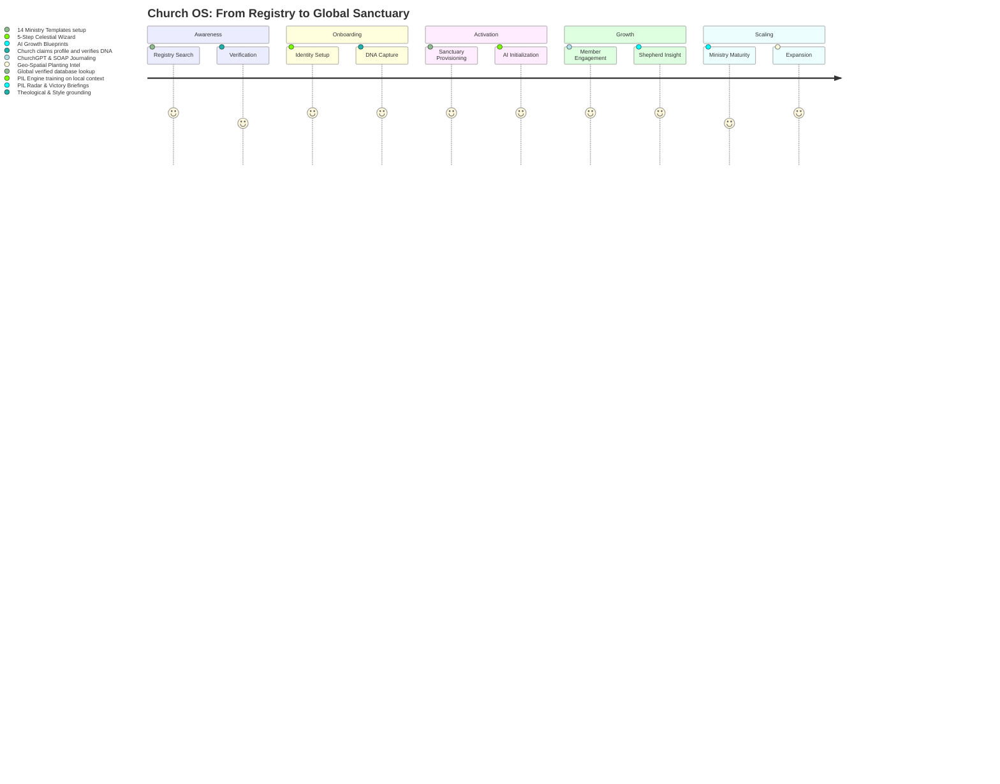
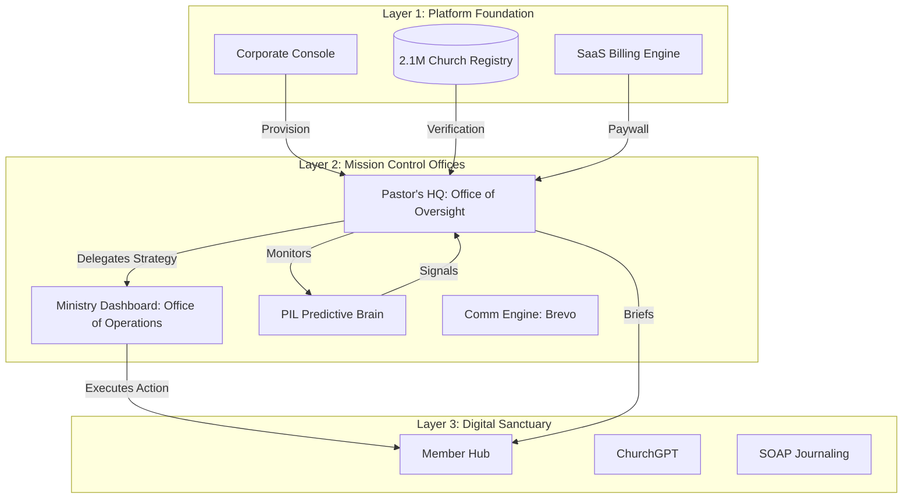

# Church OS — Enterprise Blueprint & Context

> [!IMPORTANT]
> **DOCUMENTATION INTEGRITY RULE**: This is a living document. Every strategic improvement or architectural change MUST be documented here. This is the source of truth for **Church OS PVT LTD** investors, marketing, and the AI development lead.

## 🏛️ Company Structure & Vision
- **Parent Entity**: **Church OS PVT LTD**
- **Founder & CEO**: **Shadreck Kudzanai Musarurwa**
- **Vision**: To build the "Digital Nervous System" for the global church — moving the sanctuary from manual administration to predictive, AI-orchestrated spiritual intelligence.
- **Business Model**: A multi-tenant SaaS infrastructure providing high-engagement tools for members and "Prophetic Intelligence" for leadership.

---

## 🗺️ The Church OS Journey Map (SaaS Lifecycle)



---

## 🏗️ System Architecture & Layers

### Layer 1: The Corporate Console (Platform Foundation)
*Control Center for Church OS PVT LTD Executives*
- **Global Tenant Management**: Oversight of 2.1M+ registries and active sanctuaries.
- **Platform Financials**: MRR, Churn Analytics, and Stripe/PayPal platform fees.
- **AI Ops (AIOps)**: Global Gemini quota management and PIL model performance monitoring.
- **Global Registry API**: The source of truth for all location-based church discovery.

### Layer 2: Mission Control (The Tenant Engine)
*Command & Control for the Individual Church*

This layer operates through two critical **Offices of Authority** that bridge the Gap between System Intelligence and the Member Experience:

1.  **Pastor's HQ (The Office of Oversight)**: The ultimate command center for the Senior Pastor. 
    - **Impact**: Serves as the *Supreme Approval Gate*. No insight from the PIL Engine reaches a department lead or a member without moving through this HQ. It ensures theological alignment and "Shepherd's Seal" on all machine-generated strategy.
2.  **Ministry Dashboard (The Office of Operations)**: Specialized workstations for department leads (Youth, Outreach, Worship, etc.).
    - **Impact**: Receives "Growth Blueprints" and "Care Tasks" approved by the Pastor's HQ. It converts high-level pastoral vision into vertical-specific execution.

- **PIL (Prophetic Intelligence Layer)**: 12-model predictive engine (Burnout, Drift, Crisis, Climate).
- **Communication Engine (COCE)**: Brevo-integrated dispatch for newsletter and victory briefings.

### Layer 3: The Digital Sanctuary (The Member Hub)
*High-Engagement Spiritual Environment*
- **ChurchGPT**: Multi-modal AI theological companion with "Identity Hardening," quota-gated multi-model routing (Gemini, Claude, GPT-4o mini, Kimi/Moonshot), tiered access (Guest/Starter/Lite/Pro/Enterprise), Stripe billing integration, and real-time upgrade flow.
- **SOAP Devotion**: Interactive journaling with sentiment sync to the PIL layer.
- **Growth Milestone Sync**: Unified tracking of salvation, baptism, and leadership milestones.
- **Junior Church**: Integrated guardian surveillance and child check-in security.

---

## 📊 System Structure & Data Flow



---

## 🧠 Project Concept: "The Connected Sanctuary"
Church OS isn't a management tool; it's a **Prophetic Intelligence Platform**.
- **The Concept**: Move the church from *Passive Recording* (What happened?) to *Active Discernment* (What is about to happen?).
- **The Engine**: Using ChurchGPT and the PIL models, the system identifies "Spiritual Drift" (disengagement) or "Spiritual Harvest" (geo-density clusters) weeks before a human lead would notice.
- **The Trust**: Every spiritual milestone is immutable, creating a "Spiritual Audit Trail" for the believer's entire 90-day transformation journey.

---

## 🛠️ Specialized AI Skills (The "Agentic" Manual)

| # | Skill | Trigger | Purpose |
|---|-------|---------|---------|
| 1 | `onboarding_provision` | Setup new tenant | 5-Step DNA capture -> Edge Function instantiation |
| 2 | `run_pil_audit` | Generate health report | Execute the 12-model predictive intelligence sweep |
| 3 | `ministry_strategy_gen`| Build growth blueprint | Generate vertical-specific AI strategy for a ministry |
| 4 | `sync_milestone_master` | Member landmark update | Cross-table sync of spiritual growth markers |
| 5 | `watch_retention_init` | Setup watch library | Configure 30s retention analytics and AI summaries |
| 6 | `financial_ledger_wire` | Setup church giving | Connect Stripe/PayPal and wire the financial radar |
| 7 | `coce_broadcast_dispatch`| Dispatch briefing | Summarize PIL insights and send via Brevo campaign |
| 8 | `registry_spatial_query`| expansion research | Query 2.1M registry with density & ward-based filters |

---

## 🛡️ Hardcoded Strategy Rules
- **Gemini Dominance**: Use `models/gemini-2.5-flash` for all tasks.
- **Owner Focus**: The CEO is **Shadreck Kudzanai Musarurwa**. Never cite a client as the project owner.
- **Isolation Rule**: Every query MUST be scoped: `.eq('org_id', orgId)`. No exceptions.
- **Aesthetics**: Premium Glassmorphism (Navy/Gold/Emerald) — First class first impression.

---

## 🔐 Multi-Domain Authentication Architecture (NEW - Q1 2026)

Church OS uses a **domain-isolated authentication system** that separates four distinct user contexts:

### Domain Architecture

```
┌─────────────────────────────────────────────────────────────┐
│  AUTHENTICATION LAYER (Supabase Auth)                       │
│  - Email/Password verification                              │
│  - Session management                                       │
│  - Token lifecycle                                          │
└────────────────────┬────────────────────────────────────────┘
                     │ auth.users
                     ↓
┌─────────────────────────────────────────────────────────────┐
│  IDENTITY SYNC (Trigger-based)                              │
│  - fn_sync_identities() creates identities table entry      │
│  - Ensures user exists in public.identities                 │
└────────────────────┬────────────────────────────────────────┘
                     │ identity_id
                     ↓
┌─────────────────────────────────────────────────────────────┐
│  DOMAIN CONTEXT (v_user_auth_contexts View)                │
│                                                             │
│  Domain 1: CORPORATE (admin_roles table)                    │
│    ├─ Roles: super_admin, platform_governor                │
│    └─ Access: /super-admin, /corporate/...                 │
│                                                             │
│  Domain 2: TENANT (org_members + ministry_members tables)   │
│    ├─ Roles: owner, pastor, admin, shepherd, ministry_lead │
│    ├─ Org Isolation: ONE org per login session              │
│    └─ Access: /shepherd/dashboard, /pastor-hq, /ministry... │
│                                                             │
│  Domain 3: MEMBER (member_profiles table)                   │
│    ├─ Roles: member                                         │
│    ├─ Auto-provisioning: ON (first login creates entry)     │
│    └─ Access: /member/profile, /watch-library...            │
│                                                             │
│  Domain 4: ONBOARDING (onboarding_sessions table)           │
│    ├─ Status: email_verified, org_created, admin_assigned   │
│    ├─ Auto-provisioning: ON (first login creates entry)     │
│    └─ Access: /onboarding/...                               │
└─────────────────────────────────────────────────────────────┘
```

### Authentication Flow by Domain

#### 1. Corporate (Super Admin) - RESTRICTIVE
```
User Login at /corporate/login
  ↓
BaseAuth.tsx: Query v_user_auth_contexts
  WHERE identity_id = user.id AND auth_domain = 'corporate'
  ↓
Found? (admin_roles entry exists)
  ├─ YES → Store session → Redirect to /super-admin
  └─ NO → Error: "Access denied. Admin provisioning required."
```

#### 2. Tenant (Church Leadership) - ORG-ISOLATED
```
User Login at /church/login
  ↓
BaseAuth.tsx: Query v_user_auth_contexts
  WHERE identity_id = user.id AND auth_domain = 'tenant'
  ↓
Found?
  ├─ YES (one context) → Store session + org_id → Redirect /shepherd/dashboard
  ├─ YES (multi context) → Show context selector
  └─ NO → Error: "Access denied. Tenant provisioning required."
```

#### 3. Member - AUTO-PROVISIONING
```
User Login at /member/login
  ↓
BaseAuth.tsx: Query v_user_auth_contexts
  WHERE identity_id = user.id AND auth_domain = 'member'
  ↓
Found?
  ├─ YES → Store session → Redirect to /member/profile
  └─ NO → AUTO-CREATE member_profiles entry
         → Retry query → Redirect to /member/profile
```

#### 4. Onboarding - AUTO-PROVISIONING
```
User Signup/Login at /onboarding/login
  ↓
BaseAuth.tsx: Query v_user_auth_contexts
  WHERE identity_id = user.id AND auth_domain = 'onboarding'
  ↓
Found?
  ├─ YES → Store session → Redirect to /onboarding
  └─ NO → AUTO-CREATE onboarding_sessions entry
         → Retry query → Redirect to /onboarding
```

### Session Management

**SessionStorage Keys:**
- `church_os_active_domain`: Last used domain (corporate/tenant/member/onboarding)
- `church_os_active_surface`: Last used surface (console/mission-control/profile/onboarding)
- `church_os_domain_session`: Full session object with role, org_id, permissions

**Session Recovery:**
- AuthGuard checks sessionStorage on mount
- Falls back to Supabase auth.getSession()
- Validates domain context matches path
- Clears on logout (AdminAuth.logout())

### Auto-Provisioning Rules

| Domain | New User Behavior | Auto-Create Table | Status |
|--------|------------------|------------------|--------|
| corporate | ERROR (denied) | None | Requires manual admin action |
| tenant | ERROR (denied) | None | Requires invitation or manual action |
| member | AUTO-CREATE | member_profiles | Default org: JKC (fa547adf...) |
| onboarding | AUTO-CREATE | onboarding_sessions | Sets status: email_verified, step: org_creation |

### File Structure

**Auth Components:**
- `src/components/auth/BaseAuth.tsx` — Login form with auto-provisioning logic
- `src/components/auth/BaseSignup.tsx` — Signup form (email → verify → password)
- `src/components/auth-guard.tsx` — Global route protection (AuthGuard wrapper)
- `src/components/auth/withRoleGuard.tsx` — Page-level role checking (withRoleGuard HOC)

**Session Management:**
- `src/lib/admin-auth.ts` — DomainSession type, AdminAuth.getSession(), AdminAuth.logout()
- `src/lib/supabase.ts` — Supabase client (regular, not admin)

**Signup Pages:**
- `src/app/member/signup/page.tsx`
- `src/app/onboarding/signup/page.tsx`

**Database:**
- Migration: `supabase/migrations/20260411000000_multi_domain_auth_system.sql`
- View: `v_user_auth_contexts` (UNION of all domain tables)
- Trigger: `tr_sync_identities` (auth.users → public.identities)

### Testing & Data Seeding

**Test Data Script:**
```bash
npx ts-node scripts/seed-test-data.ts
```

**Testing Guide:**
See `TESTING.md` for 8-step checklist covering all domains

**Test Users (After Seeding):**
- test-corporate@church.os / TestCorp123! → Super Admin
- test-tenant@church.os / TestTenant123! → Pastor/Owner
- test-member@church.os / TestMember123! → Member (auto-provisioned)
- test-onboarding@church.os / TestOnboard123! → Onboarding (auto-provisioned)

### Known Limitations & Future Work

1. **Corporate/Tenant Provisioning**: Currently requires manual setup. Future: Implement invitation system with email verification.
2. **Multi-Org Tenant**: A user can have roles in multiple orgs, but session is locked to ONE org per login. Future: Implement runtime org-switching.
3. **MFA**: Currently required for pastor/super_admin roles. Future: Extend to all domains at security tier 'strict'.
4. **Session Expiry**: Fixed 30-minute window. Future: Implement sliding window with refresh tokens.

### Recent Fixes (Commit 9c2e054c)

**Issues Resolved:**
- ✅ Fixed column name mismatch (user_id → identity_id) in ministry lookups
- ✅ Auto-provisioning for member and onboarding domains (prevents redirect loop)
- ✅ Improved session recovery on page refresh
- ✅ Better error messages for permission failures
- ✅ Separate Supabase auth check from domain context check

**Impact:**
- Users no longer get stuck in login redirect loops
- Member signup now works seamlessly (auto-creates profile)
- Onboarding signup now works seamlessly (auto-creates session)
- Corporate/Tenant signup shows clear permission errors
