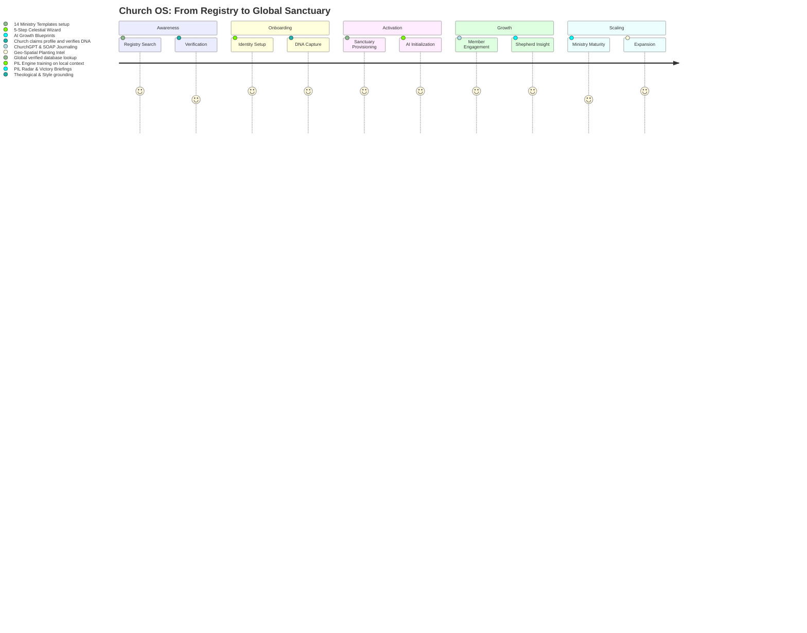
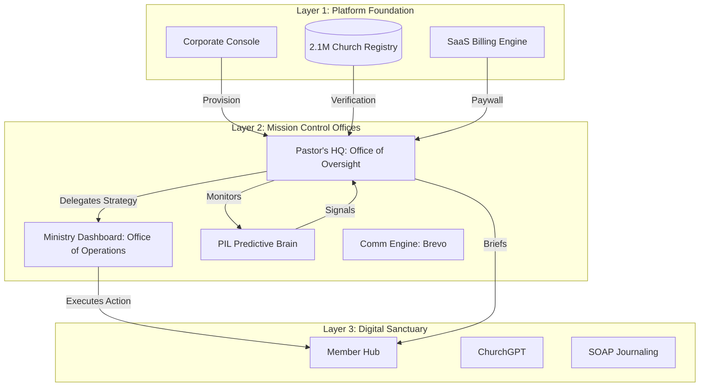

# Church OS — Enterprise Blueprint & Context

> [!IMPORTANT]
> **DOCUMENTATION INTEGRITY RULE**: This is a living document. Every strategic improvement or architectural change MUST be documented here. This is the source of truth for **Church OS PVT LTD** investors, marketing, and the AI development lead.

## 🏛️ Company Structure & Vision
- **Parent Entity**: **Church OS PVT LTD**
- **Founder & CEO**: **Shadreck Kudzanai Musarurwa**
- **Vision**: To build the "Digital Nervous System" for the global church — moving the sanctuary from manual administration to predictive, AI-orchestrated spiritual intelligence.
- **Business Model**: A multi-tenant SaaS infrastructure providing high-engagement tools for members and "Prophetic Intelligence" for leadership.

---

## 🗺️ The Church OS Journey Map (SaaS Lifecycle)

---

## 🏗️ System Architecture & Layers

### Layer 1: The Corporate Console (Platform Foundation)
*Control Center for Church OS PVT LTD Executives*
- **Global Tenant Management**: Oversight of 2.1M+ registries and active sanctuaries.
- **Platform Financials**: MRR, Churn Analytics, and Stripe/PayPal platform fees.
- **AI Ops (AIOps)**: Global Gemini quota management and PIL model performance monitoring.
- **Global Registry API**: The source of truth for all location-based church discovery.

### Layer 2: Mission Control (The Tenant Engine)
*Command & Control for the Individual Church*

This layer operates through two critical **Offices of Authority** that bridge the Gap between System Intelligence and the Member Experience:

1.  **Pastor's HQ (The Office of Oversight)**: The ultimate command center for the Senior Pastor. 
    - **Impact**: Serves as the *Supreme Approval Gate*. No insight from the PIL Engine reaches a department lead or a member without moving through this HQ. It ensures theological alignment and "Shepherd's Seal" on all machine-generated strategy.
2.  **Ministry Dashboard (The Office of Operations)**: Specialized workstations for department leads (Youth, Outreach, Worship, etc.).
    - **Impact**: Receives "Growth Blueprints" and "Care Tasks" approved by the Pastor's HQ. It converts high-level pastoral vision into vertical-specific execution.

- **PIL (Prophetic Intelligence Layer)**: 12-model predictive engine (Burnout, Drift, Crisis, Climate).
- **Communication Engine (COCE)**: Brevo-integrated dispatch for newsletter and victory briefings.

### Layer 3: The Digital Sanctuary (The Member Hub)
*High-Engagement Spiritual Environment*
- **ChurchGPT**: Multi-modal AI theological companion with "Identity Hardening."
- **SOAP Devotion**: Interactive journaling with sentiment sync to the PIL layer.
- **Growth Milestone Sync**: Unified tracking of salvation, baptism, and leadership milestones.
- **Junior Church**: Integrated guardian surveillance and child check-in security.

---

## 📊 System Structure & Data Flow

---

## 🧠 Project Concept: "The Connected Sanctuary"
Church OS isn't a management tool; it's a **Prophetic Intelligence Platform**.
- **The Concept**: Move the church from *Passive Recording* (What happened?) to *Active Discernment* (What is about to happen?).
- **The Engine**: Using ChurchGPT and the PIL models, the system identifies "Spiritual Drift" (disengagement) or "Spiritual Harvest" (geo-density clusters) weeks before a human lead would notice.
- **The Trust**: Every spiritual milestone is immutable, creating a "Spiritual Audit Trail" for the believer's entire 90-day transformation journey.

---

## 🛠️ Specialized AI Skills (The "Agentic" Manual)

| # | Skill | Trigger | Purpose |
|---|-------|---------|---------|
| 1 | `onboarding_provision` | Setup new tenant | 5-Step DNA capture -> Edge Function instantiation |
| 2 | `run_pil_audit` | Generate health report | Execute the 12-model predictive intelligence sweep |
| 3 | `ministry_strategy_gen`| Build growth blueprint | Generate vertical-specific AI strategy for a ministry |
| 4 | `sync_milestone_master` | Member landmark update | Cross-table sync of spiritual growth markers |
| 5 | `watch_retention_init` | Setup watch library | Configure 30s retention analytics and AI summaries |
| 6 | `financial_ledger_wire` | Setup church giving | Connect Stripe/PayPal and wire the financial radar |
| 7 | `coce_broadcast_dispatch`| Dispatch briefing | Summarize PIL insights and send via Brevo campaign |
| 8 | `registry_spatial_query`| expansion research | Query 2.1M registry with density & ward-based filters |

---

## 🛡️ Hardcoded Strategy Rules
- **Gemini Dominance**: Use `models/gemini-2.5-flash` for all tasks.
- **Owner Focus**: The CEO is **Shadreck Kudzanai Musarurwa**. Never cite a client as the project owner.
- **Isolation Rule**: Every query MUST be scoped: `.eq('org_id', orgId)`. No exceptions.
- **Aesthetics**: Premium Glassmorphism (Navy/Gold/Emerald) — First class first impression.
