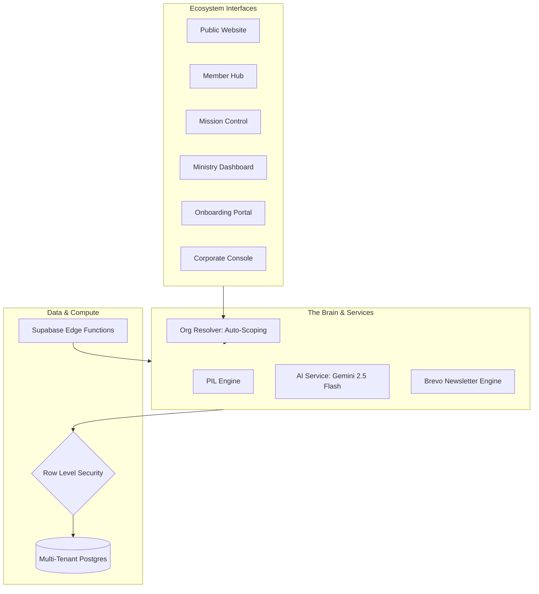

# 🕊️ Church OS: The Digital Sanctuary & Intelligence Ecosystem

[](https://nextjs.org/)
[](https://www.typescriptlang.org/)
[](https://supabase.com/)
[](https://tailwindcss.com/)
[](https://deepmind.google/technologies/gemini/)

**Church OS** is a multi-tenant, enterprise-grade spiritual platform designed for **Japan Kingdom Church (JKC)** and the global church ecosystem. It functions as a "Proactive Shepherd," merging high-engagement spiritual growth tools for members with state-of-the-art administrative and intelligence layers for leadership.

---

## 🏛️ The Five-Pillar Ecosystem

Church OS is not a single app; it is a full-stack digital ecosystem covering every layer of church life and SaaS administration.

### 🌐 1. Public Website & Member Hub (`/public`, `/devotion`)
The visitor-facing storefront and the member's spiritual "secret place."
- **Tenant Branding**: Dynamically pulls name, logo, and core colors from the `organizations` table via the `org-resolver`.
- **SOAP Devotion Engine**: A daily journaling system (Scripture, Observation, Application, Prayer) with SVG-based progress tracking.
- **AI Bible Concierge**: A context-aware chat interface for historical and cultural scripture insights.
- **Bilingual Scripture**: Instant NASB/Japanese toggle for international congregations.

### 🛡️ 2. Mission Control: The Shepherd Dashboard (`/shepherd`)
The administrative heartbeat for managing spiritual health and engagement.
- **Engagement Radar**: A 0-100 score for every member based on devotion streaks and service activity.
- **Care Alerts**: Color-coded triggers (🔴 Critical, 🟡 Warning) for inactive members requiring pastoral follow-up.
- **Victory Briefings & Newsletters**: Automated, AI-summarized church updates and spiritual briefings dispatched via the Brevo engine.
- **Counseling Queue**: Managing prayer and guidance requests with prioritized categories.
- **Operational Pulse**: Real-time stats on church-wide spiritual climate.

### 📊 3. Ministry Leadership Dashboard (`/ministry-dashboard`)
Scoped intelligence for specific ministry leads (Worship, Media, Kids, Evangelism).
- **Ministry-Specific Insights**: AI-generated growth opportunities tailored to each department.
- **Insight Approval Gate**: A unique pastoral review bridge where AI insights are vetted before being dispatched to ministry leaders.
- **Resource Matching**: Analyzing member skills and spiritual gifts against ministry needs.

### ⚡ 4. Church Onboarding & SaaS Portal (`/onboarding`)
The gateway for new churches to register and provision their own "Digital Sanctuary."
- **SaaS Provisioning**: Multi-tier registration flow (Lite, Pro, Enterprise).
- **AI Intelligence DNA**: Captures the church's tradition, worship style, and language to ground the AI.
- **Growth Blueprints**: Automated provisioning of the first AI-generated growth strategy upon account setup.
- **Magic Link Invitations**: Secure, seamless onboarding for church staff.

### 🏢 5. Corporate Console: The Super Admin Layer (`/super-admin`)
The "God-mode" administration for the platform itself.
- **Platform Analytics**: High-level metrics on MRR, user churn, and platform growth across all tenants.
- **Tenant Management**: Overlooking all registered church organizations and their health scores.
- **System Orchestration**: Monitoring background cron jobs (Weekly Sweeps, AI Workers) and serverless function performance.

---

## 🧠 Prophetic Intelligence Layer (PIL)
The "Prophetic Intelligence" brain powers all insights across the ecosystem using 12 predictive models:
- **Disengagement Modeling**: Identifying drift before it becomes a departure.
- **Spatial Strategy**: Mapping member density across city wards to identify locations for new church plants.
- **Collective Pulse**: Aggregate sentiment modeling from anonymized journal data to gauge the "spiritual temperature" of the house.
- **Sermon Impact Analysis**: Correlating Sunday messages with the following week's journaling themes.

---

## 🏗️ Technical Architecture & Developer Ops



### 🪄 Agent Skills & Acceleration (`.antigravity/skills/`)
The repository is optimized for **Agentic Development** with over 20+ specialized skills:
- `create_feature_module`: High-fidelity scaffolding of ecosystem pages.
- `provision_ai_intelligence`: Automating the SaaS provisioning lifecycle.
- `multi-tenant-scoping`: Wiring hostname → `org_id` resolution into UI layers.
- `ministry_insight_approval`: Orchestrating the pastoral review workflow.

---

## 📂 Project Organization

```text
├── .antigravity/skills/   # Agentic accelerators for ecosystem growth
├── knowledge/             # Domain personas, prompt libraries, and grounding data
├── supabase/
│   ├── functions/         # Edge logic (Weekly sweeps, provisioners, broadcasts)
│   └── migrations/        # RLS multi-tenant database schema
├── src/app/
│   ├── (public)/          # Tenant-branded public presence
│   ├── shepherd/          # Mission Control (Admin Dashboard)
│   ├── ministry-dashboard/ # Leadership-scoped intelligence
│   ├── onboarding/        # Church SaaS registration flow
│   ├── super-admin/       # Corporate/Platform administration
│   └── lib/               # Core Services (PIL Engine, Org Resolver, AI)
├── scripts/               # Migration, maintenance, and RLS audit scripts
└── docs/                  # Operations Manual, Context, and Journey guides
```

---

## 🏁 Quick Start & Index
- [**Operations Manual**](./CHURCH_OS_OPERATIONS_MANUAL_v2.md) — Visual testing guide for each layer.
- [**Technical Context**](./PROJECT_CONTEXT.md) — Internal roadmap and technical specs.
- [**Customer Journey**](./customer_journey_and_usecase.md) — UX flows from Onboarding to Daily Devotion.

---

## 🛡️ Project Guardrails (Locked Components)
To ensure layout stability and visual consistency, the following components and patterns are **locked**:

1.  **Top Navigation Bar (`PublicNav.tsx`)**
    *   **Positioning**: Must remain `fixed top-0`. Do not change to `sticky` or `relative`.
    *   **Height**: Hardcoded to `h-16`. All page content must account for this (typically via Hero sections or `pt-16`).
    *   **Theme Visibility**: Link colors are dynamically calculated based on `scrolled`, `isDark`, and `isHomePage`. Do not hardcode colors to white or black without consulting these states.
    *   **Boundary**: No top-padding (`pt-*`) should be added to the main container of the Home page (`WelcomeClient.tsx`) as the Hero must sit directly behind the transparent navbar.

---

Built with reverence for the ministry of **Japan Kingdom Church**.
**Version 3.0.1 — Digital Transformation for the Kingdom.**
