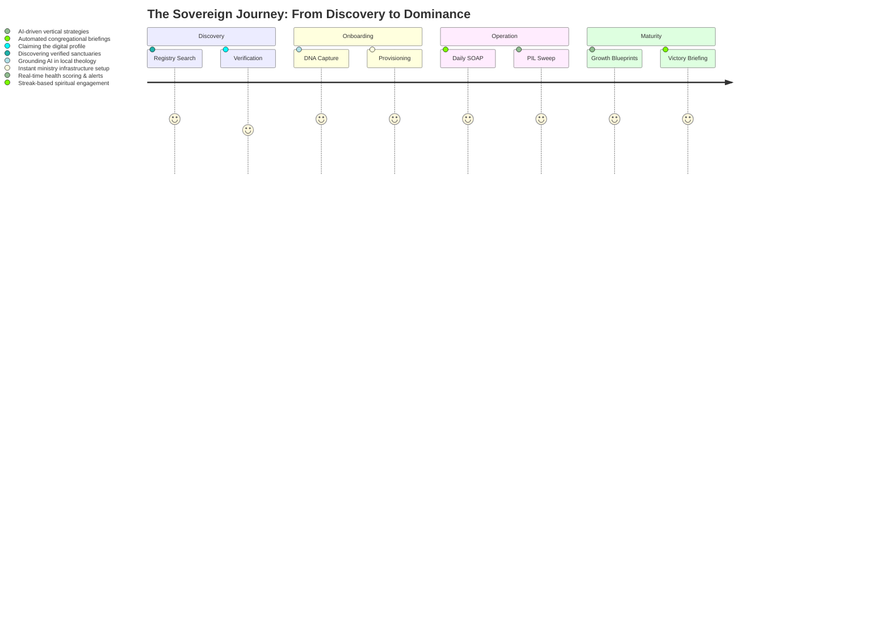

# 🕊️ Church OS: The Intelligence Ecosystem for the Global Sanctuary

[](https://churchos.io)
[](https://churchos.io)
[](https://churchos.io)

**Church OS** is an enterprise-grade, multi-tenant spiritual infrastructure owned and orchestrated by **Church OS PVT LTD**. It represents a paradigm shift from "Church Management" to "Prophetic Intelligence," merging high-fidelity member engagement with a 12-model predictive brain for leadership.

---

## 🏛️ The Triple-Layer Architecture

### 🛡️ Layer 1: Corporate Console (Platform Foundation)
The global engine room for **Church OS PVT LTD**.
- **Global Verified Registry**: Management of 2.1M+ sanctuaries worldwide.
- **SaaS Lifecycle**: Corporate-level MRR, churn tracking, and multi-tenant provisioning.
- **AIOps Control**: Global monitoring of Gemini orchestration and PIL model health.

### 📊 Layer 2: Mission Control (The Tenant Engine)
The administrative heartbeat and decision-making nerve center. Operated through two specialized offices:
- **Pastor's HQ (Office of Oversight)**: The command center for the Senior Pastor. Features the ultimate "Approval Gate" for all PIL-generated insights and congregational strategic pivots.
- **Ministry Dashboard (Office of Operations)**: Vertical-specific workstations for department leads. Converts pastoral vision and "Growth Blueprints" into tactical department actions.
- **PIL (Prophetic Intelligence Layer)**: 12-model predictive array for identifying organizational drift and ministry opportunities.

### 🌐 Layer 3: The Digital Sanctuary (The Member Hub)
The spiritual "Secret Place" and front-line engagement layer.
- **ChurchGPT**: Multi-modal theological AI built for deep scriptural discourse.
- **Journey Milestones**: Immutable tracking of the believer's 90-day transformation journey.
- **Watch Library**: AI-enhanced sermon library with interactive transcripts and retention analytics.

---

## 🗺️ The Church OS Journey



---

## 🧠 The Prophetic Intelligence Layer (PIL)
Church OS uses a 12-model predictive array to monitor sanctuary vitality:
- **Disengagement Risk**: Identifying drift before it becomes a departure.
- **Spiritual Climate**: Forecasting congregational sentiment from anonymized SOAP data.
- **Spatial Strategy**: Using density clusters to identify Bible study and planting locations.
- **Pastoral Capacity**: Mapping care load vs. staff burnout risk.

---

## 🏗️ Technical Ops & Skills
Church OS is built for **Agentic Development** with over 20+ specialized skills tailored for the ecosystem:
- `onboarding_provision`: Celestial wizard orchestration.
- `run_pil_sweep`: 12-model health audit execution.
- `ministry_blueprint`: vertical strategy generation.
- `watch_analytics`: automated retention tracking.

---

## 📂 Project Organization
```text
├── supabase/
│   ├── functions/         # Edge logic (Billing, Provisioning, Briefings)
│   └── migrations/        # RLS-hardened tenant schema
├── src/app/
│   ├── (public)/          # Branded member sanctuary & Watch library
│   ├── shepherd/          # Mission Control (Admin Dashboard)
│   ├── onboarding/        # Church SaaS registration flow
│   ├── super-admin/       # Corporate/Platform analytics
│   └── lib/               # Core Brain (PIL Engine, Org Resolver, COCE)
└── docs/                  # Blueprint, Operations Manual, Context
```

---

Built and orchestrated for the Global Sanctuary by **Church OS PVT LTD**.
**Founder & CEO: Shadreck Kudzanai Musarurwa**
**Version 3.1.0 — Enterprise Architecture Locked.**
